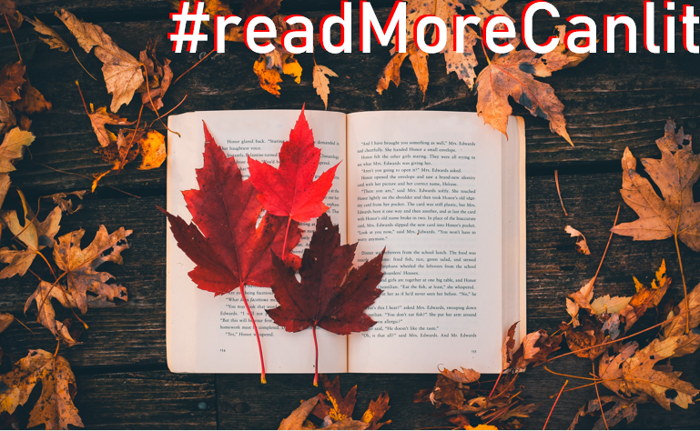

# #readMoreCanlit | A Recommender System for Canadian Literature

​     

​     

> Shawn Syms 
> https://shawnsyms.github.io/  
> shawn@shawnsyms.com  
> 416-843-4169  

## Contents

* <a href="#executive-summary">Executive summary</a> 
* <a href="#overview">Overview</a> 
* <a href="#problem-statement">Problem statement</a> 
* <a href="#data-sources">Data sources</a> 
* <a href="#limitations">Limitations</a> 
* <a href="#tools-and-technologies">Tools and technologies</a> 
* <a href="#visuals">Visuals</a> 
* <a href="code/1_data_acquisition.ipynb">Notebook 1: Data acquisition</a> 
* <a href="code/2_data_cleaning_and_visualization.ipynb">Notebook 2: Data cleaning and visualization</a> 
* <a href="code/3_recommender_system.ipynb">Notebook 3: Recommender system</a> 

## Executive summary

### Overview
#readMoreCanlit is a content-based recommender system that promotes the reading of Canadian literature. 

According to a recent survey by the non-profit organization BookNetCanada, 92% percent of Canadians had read a paper copy of a book, and use of e-reading devices had increased by 25% over the previous year. Still, the Canadian best-seller lists tend to be dominated by American and international titles. #readMoreCanlit could serve as part of a consolidated marketing program to promote reading Canadian literature. Future phases could include a purchasing engine.  

### Problem statement

I will build a content-based recommender system that accepts input from readers about content they like, and makes appropriate recommendations of similar titles from a dataframe of Canadian books: 

* The user should also be able to provide the name of a book , or they can select one from a list of 5 titles that the system already knows about
* The user should also be able to input a freeform sentence about the type of book that they like
* The baseline for comparison could be whether or not the system can make recommendations that are better than random guessing (if time permits I could build the random generator also; in fact it could be feature -- ie, just tell me about any 5 Canadian books.

### Data sources

- The system requires the following data points: title, author and description
- For Canadian books, the source was a specialist site called 49thshelf.com, from which I extracted information on 8,500 Canadian fiction titles
- After removing duplicates, I had 6,775 Canadian titles
- To get the non-Canadian titles, I needed to source International Standard Book Numbers (ISBNs). I searched online and found extensive lists of ISBNs in several places, including openlibrary.org and data.planet. From these sources, I collected 2.7M ISBNs
- I used the API furnished by a directory called ISBNdb.com to cycle through the ISBNs 15,000 at a time (a daily limit), querying the database for title, author and description information (the lists themselves contained the ISBNs only)
- I found that the ratio of database entries that actually included descriptions (which are core to the recommender system) was quite small -- five to ten percent at best -- so the process of gathering sufficient numbers of non-Canadian titles has been somewhat painstaking
- Ultimately I was able to produce a list of over 10,000 international titles on which to train the model

(<a href="#contents">home</a>) 

### Metrics
Recommender systems are known to be challenging from a metrics perspective. In the case of this project, I am using domain knowledge to assess performance, and will also be conducting a survey of my peers to get their input on the effectiveness of the model. I'm researching other potential metrics; I did see one instance where a scikit learn accuracy score was used.

### Findings

- Use of scikit learn's TFIDF vectorizer and cosine similarity allows for a model that trains very quickly (x seconds) and whose results are satisfying
- Between now and when the project is due, I'd like to try some additional approaches, such as gensim and neural networks

### Limitations

- The project is de facto limited by my coding capabilities, though they are improving every day
- The low number of books catalogued by the application (both Canadian and international) is a limitation; this affects both (1) quality and diversity of results and (2) the likelihood that a user will enter a book title of which the model is not yet aware 

(<a href="#contents">home</a>) 

## Tools and technologies

> * This project uses regex and NLTK's Porter Stemmer for text preprocessing
> * The application was coded using Python, flask, pandas and scikit learn
> * Because this project involved many pieces of text that need to be compared to one another, the text was transformed and catalogued by the TF-IDF (term frequency–inverse document frequency) Vectorizer

#### Libraries
Here is a list of libraries used in the notebooks and in the development of the system (please see the import cells and requirements.txt for full details: 

> - beautifulsoup
> - datetime
> - json
> - lxml
> - matplotlib
> - nltk
> - numpy
> - pandas
> - pprint
> - random
> - regex
> - requests
> - seaborn
> - sklearn
> - time
> - urllib 

(<a href="#contents">home</a>) 

